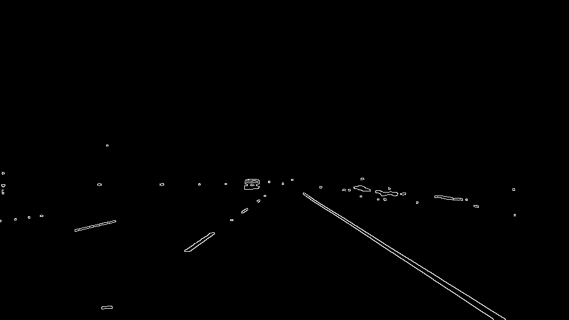

# Self Driving Car - Finding Lane Lines on the Road 

## Overview
The project has two major sections; The first section is to develop a processing pipeline on a series of test images, and the pipeline will process each image and mark the lane lines on the road. The second second section is to take the pipeline algorithm and apply it to a set of videos.

The pipeline stages are:
1. Read an Image and apply a Color Filter
2. Convert the color filtered image to gray scale
3. Apply Gaussian smoothing on the gray scaled image
4. Find edges on the smoothed image using Canny edge detection algorithm
5. Identify a region of interest to focus in on edges on the road
6. Apply the Hough Tranform within the region of interest to find lines from edges  
7. Identify left and right lanes and extrapolate line segments into continous lines  
8. Add overlay of lines on original image

## Section 1 Pipeline processing on test images

### Color Filtering
Typically lanes on the road are a single color and painted as broken or continous lines. The lanes stand-out from the background to provide a driver or self-driving car a safe zones for driving and the lane colors/markings have certain meanings. A self driving car must understand the rules of the road and how to interpret the lane lines. The types of lines typically found are:
- Solid White Line: Can mark the right edge of many roads and also marks the shoulder of the roadway.
- Broken White Line: Usually on center lanes and allow a driver to change lanes if it is safe to do so.
- Yellow lines: Can mark the edge of a road or the center of a two-way road used for two-way traffic. A driver may pass on a two-way road if the yellow centerline is broken. When a solid and a broken yellow line are together, a driver must not pass if driving next to the solid line. Two solid yellow lines mean no passing.
- The center marking for roads with four lanes may consist of two solid yellow lines. 

The pipeline will apply a white and yellow color mask on the image to extract only the colors of interest. There are a number of color spaces that can be used for color filtering, the most common are :
- RGB ( Red, Green, Blue )
- HSV ( Hue, Saturation, Value )
- HSL ( Hue, Saturation, Lightness )

Image Format
An image is loaded in RGB color space. The image comprises of three channels one for each of the Red, Green, Blue channels. Each channnel is stored as a matrix of rows and columns, where each pixel[row,col] is stored as an intensity level [0-255], where 255 is white, 0 is black.

We can convert an image from RGB or (BGR) space to HSL or HSV Color Space using OpenCV function `cv2.cvtColor()`. When filtering out colors we need to consider colors of different light intensity and shades. To create a color mask, a lower and upper range is identifed to filter out the color. OpenCV has a routine `cv2.inRange( img, lower, upper )`.  
```
    lower = np.uint8( [192,192,192] )
    upper = np.uint8( [255,255,255] )
    white_mask = cv2.inRange( img, lower, upper )

    lower = np.uint8( [192,192,0] )
    upper = np.uint8( [255,255,255] )
    yellow_mask = cv2.inRange( img, lower, upper )
```
    
The white and yellow masks can be merge together using `cv2.bitwise_or( white_mask, yellow_mask )` and then the combined mask applied to the image using `cv2.bitwise_and( img, img, mask = color_mask )` to preserve the color and mask out (make remaining pixels black) to the remaining image. This process significantly reduces the noise in the image and provides a higher probability of a successful of identifying lane lines. For this project I created two masks: one for white lanes and one for yellow lanes as shown above.

**Example: Combined white and yellow color mask**


Some useful color space references: [Rapidtables](https://www.rapidtables.com/convert/color/) and [OpenCV Color Conversions](https://docs.opencv.org/3.1.0/de/d25/imgproc_color_conversions.html)

### Convert to Gray Scale 
The color filtered image reduced the pixels in the image to the colors we need for finding lanes. However we ultimatley want to detect edges on lane lines and the edge detection algorithm doesn't use color for detection but identifies large differences in intensities in neighbouring pixels to detect edges. We can therefore convert the image to gray scale and reduce the image size without losing useful information. We can use the OpenCV routine `cv2.cvtColor()` to convert an image to gray scale. 

**Example: Gray scaled image** 


### Apply Gaussian Smoothing 
The image to this point was color filtered and converted to gray scale. Before we can run an edge detection algorithm we want to eliminate as much noise as possible from the image. After the smoothing algorithm is applied, the high frequency noise is removed and the edges in the image will be smoother and provide a higher probability of detecting good quality edges from the image.  A number of smoothing techniques can be used to filter out unwanted noise. Some typical smoothing filters are:
- Averaging
- Median
- Gaussian Blur

This project uses Gaussian smoothing because most edge-detection algorithms are sensitive to noise. Other filters are more sensitive to noisy environments. A Gaussian filter is typically used before edge detection because it reduces the noise in the image, and improves the result of the following edge-detection algorithm.  OpenCV has routine for Gaussian smoothing: `cv2.GaussianBlur()` Details can be found here: [OpenCV Smoothing Images](http://opencv-python-tutroals.readthedocs.io/en/latest/py_tutorials/py_imgproc/py_filtering/py_filtering.html)

**Example: Gaussian smoothed image** 


### Find edges using Canny edge detection algorithm
An edge detection algorithm detects areas of the image that have rapidly changing intensity values. Algorithms find these rapidly changing values by taking derivates of neighbouring pixels. Typically these rapidly changing areas are typically edges. 
A number of edge detection algoithms exist:
- Sobel ( first order derivative )
- Laplacian ( second order derivative )
- Canny edge detection

One of the best edge detection algorithms is athe Canny Edge Detection.  The Process of Canny edge detection algorithm [Canny Edge Detector Wiki](https://en.wikipedia.org/wiki/Canny_edge_detector) can be broken down to 5 different steps:
1. Apply Gaussian filter to smooth the image in order to remove the noise
2. Find the intensity gradients of the image
3. Apply non-maximum suppression to get rid of spurious response to edge detection
4. Apply double threshold to determine potential edges
5. Track edge by hysteresis: Finalize the detection of edges by suppressing all the other edges that are weak and not connected to strong edges.

The OpenCV canny function is `cv2.Canny(img, low_threshold, high_threshold)`. The low and high thresholds are used to accept of reject pixel gradients. If a pixel gradient is higher than the upper threshold, the pixel is accepted as an edge.  If a pixel gradient value is below the lower threshold, then it is rejected. If the pixel gradient is between the two thresholds, then it will be accepted only if it is connected to a pixel that is above the upper threshold. The recommended ratio of upper to lower thresholds is between 2:1 and 3:1. This project will use Canny edge detection with a low_threshold of 50 and high_threshold of 150.

**Example: Canny edges image**



### Identify a region of interest to focus in on edges
The entire image is not needed for lane detection. Once edges have been detected, many regions of the image can be ignored to reduce processing. We can exclude the region outside the region of interest by applying a mask.
OpenCV has a userful function `cv2.fillPoly( mask, vertices, ignore_mask_color )` Reference: [cv2.fillPoly API Reference](https://docs.opencv.org/2.4/modules/core/doc/drawing_functions.html#fillpoly)
The parameters are : 
- mask (image to apply region selection) 
- vertices ( x,y points on the polygon to keep )  
- ignore_mask_color ( color mask )  
           
**Example: Region of interest image**


### Probabilistic Hough Transform
The Hough transform is a feature extraction technique used in image analysis, computer vision, and digital image processing. The purpose of the technique is to find imperfect instances of objects within a certain class of shapes by a voting procedure. This voting procedure is carried out in a parameter space, from which object candidates are obtained as local maxima in a so-called accumulator space that is explicitly constructed by the algorithm for computing the Hough transform.  The classical Hough transform was concerned with the identification of lines in the image, and this is what we need for lane finding. [Hough Transform Wiki](https://en.wikipedia.org/wiki/Hough_transform )

The traditional hough transform requires a lot of computation. The Probabilistic Hough Transform is an optimization of Hough Transform and is based on Robust Detection of Lines Using the Progressive Probabilistic Hough Transform by Matas, J. and Galambos, C. and Kittler, J.V. It doesn’t take all the points into consideration, instead take only a random subset of points and that is sufficient for line detection. The OpenCV Probablistic Hough Lines `cv2.HoughLinesP()` takes a number of parameters as follows:   

- masked_edges
- rho (the distance of our grid in hough space)
- theta (the angular resolution of our grid in hough space)
- threshold, (Accumulator threshold parameter)
- min_line_length (Lines shorter than min_line_length are rejected)
- max_line_gap (Maximum allowed gap between points on the same line)
           
 Details of the OpenCV Hough lines transform can be found here: [Hough Lines](https://docs.opencv.org/3.3.1/d9/db0/tutorial_hough_lines.html)

### Identify left and right lanes and extrapolate line segments into continous lines  
The final step in the pipeline will be to draw lane lines on the image.  We will use the equation of a line `y=mx+b` to extrapolate lines. The image origin is the top left corner therefore the slope `m` variable is reversed for right and left lanes. In general we iterate over the set of lines seperate them into left and right lists and then use a linear regression to extract endpoints of the the lane lines. These lane lines are then overlayed on the original image.
The steps involved for drawing lane lines is:
1. Identify left and sides of the image by calculating x_mid from image attributes
2. Identify y1 and y2 for left and right lanes from image attributes
3. Iterate over each line from the array and calculate slope = ( y2 - y1 ) / ( x2 - x1 )
4. Ignore zero and infinte slope values
5. Image origin is topleft, place negative slope is left lane list, positive slope is right lane list
6. Perform linear regression on left and right points.  `m,b = np.polyfit( x_points, y_points, 1 )`
7. Solve for x1: `x1 = ( y1-b ) / m`
8. Solve for x2: `x2 = ( y2-b ) / m`
9. Overlay left and right lanes using `cv2.line()` 

**Example: Lines overlayed on the image** 


## Section 2 Pipeline processing on test images
This section leverages the hard work done in section 1. In order to process video withing jupyter notebook I had to include VideoFileClip package and import HTML from iPython.display. Processing a video is just processing a series of images and therefore we can reuse many of the functions from `process_pipeline` in `process_image`. The save_image function is not used in `process_image` as the VideoFileClip application can be used to save the output videos to test_videos_output directory.


## Shortcomings of pipeline
- The Region of Interest is somewhat hard-coded to the test images. This may not be optimal for other test cases.
- Detecting color shades and lightness is not straightforward. I spent too much time identifying color spaces and color masks. These settings may not be optimal for other test cases.
- There are many parameters that need to be hand tuned, i.e. ( Hough Transform, Gaussian Smoothing, Canny Edge Detection ). These hand-tuned settings may not be optinal for other test cases.

## Improvements to pipeline
- The challenge section highligted some short comings of the pipeline that need improvement.
- Calculate ROI region automatically.
- Automatically tune parameters for pipeline functions i.e. (Hough, Gaussian, Canny).
- Do a better job of filtering line segment slopes and rejecting bad quality edges.
- Perhaps apply machine learning to tune for optimal parameters.
